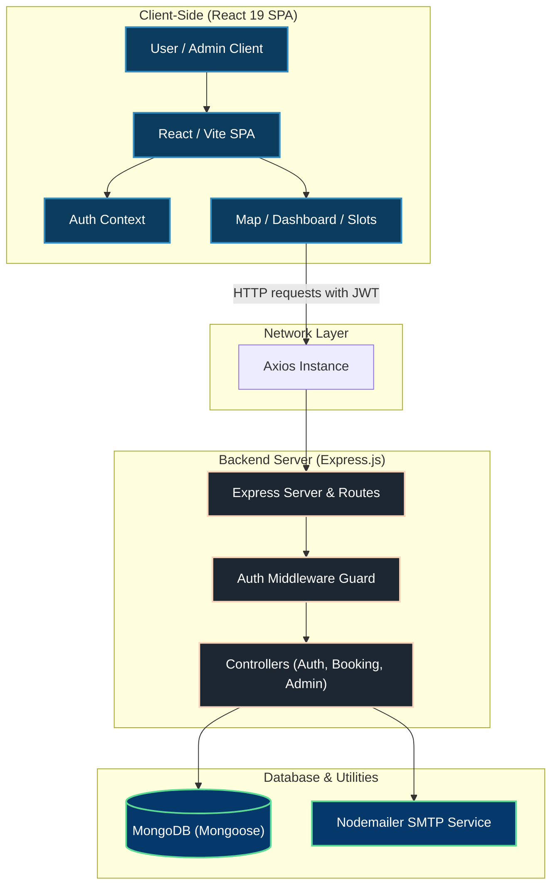
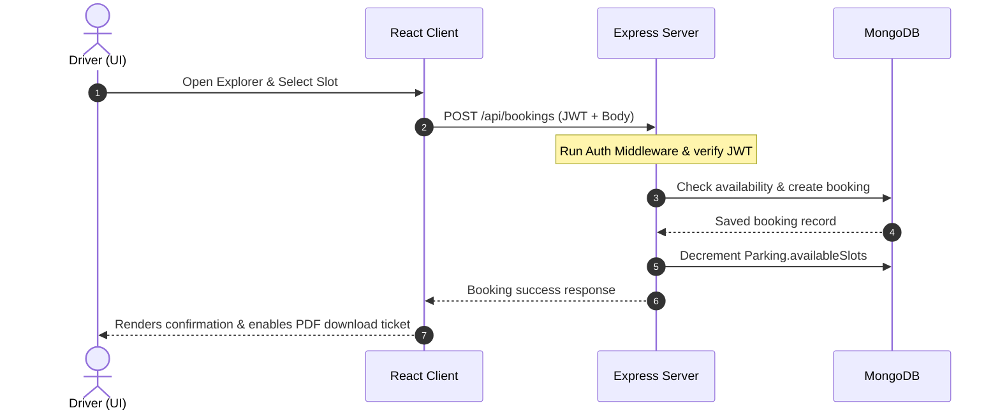

<h1 align="center">🚗 Parkfinder</h1>

<p align="center">
  A state-of-the-art, feature-rich, and secure <strong>Full-Stack Urban Parking Management System</strong>. Designed to solve modern urban parking availability, search, and reservation challenges, Parkfinder provides an interactive, role-based platform for Users and Administrators. Built using high-performance technologies like <strong>React 19</strong>, <strong>Vite</strong>, <strong>TypeScript</strong>, <strong>Tailwind CSS v4</strong>, and <strong>Express.js</strong>.
</p>

<p align="center">
  <a href="https://github.com/imanchalsing/parkfinder">
    
  </a>
  
  
  
  
  
</p>

<p align="center">
  <strong>🔗 Live Demo: <a href="https://parkfinder-three.vercel.app/" target="_blank">parkfinder-three.vercel.app</a></strong>
</p>

---

## 📌 Table of Contents

- [🚀 Key Features](#-key-features)
  - [🔐 Authentication & Authorization](#-authentication--authorization)
  - [🗺️ Interactive Locator & Search](#️-interactive-locator--search)
  - [📅 Booking & Reservation System](#-booking--reservation-system)
  - [📊 Analytics & Dashboards](#-analytics--dashboards)
  - [👑 Admin Control Panel](#-admin-control-panel)
  - [🎫 Ticket & Export Utilities](#-ticket--export-utilities)
- [🛠️ Tech Stack & Ecosystem](#️-tech-stack--ecosystem)
  - [Frontend](#frontend)
  - [Backend](#backend)
- [📈 Application Workflow](#-application-workflow)
- [⚙️ Local Setup Guide](#️-local-setup-guide)
  - [Pre-requisites](#pre-requisites)
  - [1. Backend Setup](#1-backend-setup)
  - [2. Frontend Setup](#2-frontend-setup)
- [� Security & Environment Variables](#-security--environment-variables)
- [�📁 Project Directory Structure](#-project-directory-structure)
- [☁️ Deploy on Render / Vercel](#️-deploy-on-render--vercel)
- [🤝 Contributing (SSOC '26)](#-contributing-ssoc-26)
- [⭐ Show Your Support](#-show-your-support)
- [👤 Author](#-author)

---

## 🚀 Key Features

Parkfinder provides a tailored experience with role-based access for drivers and parking administrators.

### 🔐 Authentication & Authorization

- **Secure JWT Authentication**: Tokens stored securely in context memory for session persistence.
- **Role-Based Access Control (RBAC)**: Distinct permissions for standard Users and system Admins.
- **Security Standards**: Hashed user passwords using Bcrypt / BcryptJS, route protection middlewares, and CORS origin controls.
- **Password Recovery**: Complete secure email workflow for Forgot/Reset passwords utilizing Nodemailer.
- **Environment-Based Secrets**: JWT and admin secrets managed through secure environment variables (no hardcoded keys).

### 🗺️ Interactive Locator & Search

- **Dual Layout Grid**: Seamless toggle between interactive Map (Leaflet) and list card formats.
- **Live Filtering**: Sort parking lots instantly based on location, price, rating, safety level, covered status, and slot availability.
- **Proximity Calculation**: Displays approximate distances from central locations to make booking decisions easier.

### 📅 Booking & Reservation System

- **Dynamic Slot Counter**: Real-time decrement of available slots as new bookings are committed.
- **Log Management**: Vehicle Entry & Exit tracking to log vehicle location logs and elapsed durations.
- **Immediate Receipts**: Instant reservation confirmations containing invoice amounts.

### 📊 Analytics & Dashboards

- **User Dashboard**: Real-time tracker for total bookings, active parking logs, spent history, and recent logs.
- **Interactive Visualizations**: Clean Recharts graphs displaying analytics summaries.

### 👑 Admin Control Panel

- **Database Oversight**: Superuser dashboard controls to create, modify, and delete parking locations.
- **User Management**: Monitor list logs of registered drivers, manage login credentials, and handle role assignments.
- **System Diagnostics**: Detailed tables showing system metrics and vehicle entry/exit history.

### 🎫 Ticket & Export Utilities

- **PDF Ticket Exports**: Client-side ticket printing module converting HTML elements into PDF downloads via `jsPDF` and `html2canvas`.

---

## 🛠️ Tech Stack & Ecosystem

### Frontend

- **Library**: [React 19](https://react.dev/) & [TypeScript](https://www.typescriptlang.org/)
- **Build Tool**: [Vite](https://vite.dev/)
- **Styling**: [Tailwind CSS v4](https://tailwindcss.com/) & custom CSS modules
- **Routing**: [React Router v7](https://reactrouter.com/) (includes protected client-side routes)
- **Map Integrations**: [Leaflet](https://leafletjs.com/) & [React Leaflet](https://react-leaflet.js.org/)
- **Data Visualizations**: [Recharts](https://recharts.org/) & [Chart.js](https://www.chartjs.org/)
- **Asset Management**: [Lucide React](https://lucide.dev/) (sleek modern icons)
- **Animations**: [Framer Motion](https://www.framer.com/motion/) (smooth state transitions)
- **PDF Exporter**: `jsPDF` & `html2canvas`

### Backend

- **Runtime**: [Node.js](https://nodejs.org/)
- **Framework**: [Express.js v5](https://expressjs.com/) (highly performing router)
- **Database**: [MongoDB](https://www.mongodb.com/) via [Mongoose](https://mongoosejs.com/) (ODM)
- **Encryption**: JSON Web Tokens (JWT) & BcryptJS
- **Notifications**: Nodemailer (SMTP configs for transactional mails)

---

## 📈 Application Workflow

The diagram below represents how different components of the Parkfinder architecture communicate:



Below is the standard sequence of actions for user registration and booking reservation:



---

## ⚙️ Local Setup Guide

Follow these steps to run a copy of the project locally on your machine.

### Pre-requisites

- **Node.js** (v18.x or above recommended)
- **MongoDB** (Local instance or MongoDB Atlas cluster URI)
- **NPM** or **Yarn**

### 1. Backend Setup

1. Navigate to the backend server directory:
   ```bash
   cd server
   ```
2. Install the backend dependencies:
   ```bash
   npm install
   ```
3. Create your local environment configuration file:
   Create a `.env` file in the `server/` directory and paste the following configurations:

   ```env
   # Required - Security Configuration
   JWT_SECRET=your-secure-random-jwt-secret-key-min-32-chars
   ADMIN_SECRET=your-secure-admin-secret-key-min-32-chars

   # Server Configuration
   PORT=5000

   # Database Configuration
   MONGO_URI=mongodb://127.0.0.1:27017/parkfinder

   # Frontend Configuration
   FRONTEND_URL=http://localhost:5173

   # Email/SMTP Configuration
   SMTP_HOST=smtp.gmail.com
   SMTP_PORT=587
   SMTP_USER=example@gmail.com
   SMTP_PASS=your_smtp_app_password
   SMTP_SECURE=false
   EMAIL_FROM=no-reply@parkfinder.com
   ```

   ⚠️ **IMPORTANT SECURITY NOTES:**
   - **NEVER** commit the `.env` file to version control
   - Use strong, random strings for `JWT_SECRET` and `ADMIN_SECRET` (minimum 32 characters)
   - Generate secure secrets using: `openssl rand -base64 32`
   - A `.env.example` file is provided as a template for reference

4. Seed the database with default parking slot records:
   ```bash
   node seed.js
   ```
5. Start the Express development server:
   ```bash
   npm run dev
   ```
   _The API will start running on_ `http://localhost:5000`

### 2. Frontend Setup

1. Open a new terminal window/tab and navigate to the client directory:
   ```bash
   cd client
   ```
2. Install the frontend dependencies:
   ```bash
   npm install
   ```
3. Create your frontend environment configuration file:
   Inside `client/.env`:
   ```env
   VITE_API_URL=http://localhost:5000
   ```
4. Start the React/Vite development server:
   ```bash
   npm run dev
   ```
   _The client app will compile and start running on_ `http://localhost:5173`

---

## � Security & Environment Variables

### Critical Security Configuration

ParkFinder requires secure environment variables for JWT token signing and admin account protection. These should **never** be hardcoded in your application.

#### Required Variables

| Variable       | Purpose                                   | Generation                |
| -------------- | ----------------------------------------- | ------------------------- |
| `JWT_SECRET`   | Sign and verify JWT authentication tokens | `openssl rand -base64 32` |
| `ADMIN_SECRET` | Validate admin account creation requests  | `openssl rand -base64 32` |

#### Setup Instructions

1. **Create `.env` file in the `server/` directory:**

   ```bash
   cp .env.example .env
   ```

2. **Generate secure secrets:**

   ```bash
   # On Mac/Linux
   openssl rand -base64 32  # Use output for JWT_SECRET
   openssl rand -base64 32  # Use output for ADMIN_SECRET
   ```

3. **Update `.env` with generated values:**

   ```env
   JWT_SECRET=<your-generated-secret-here>
   ADMIN_SECRET=<your-generated-secret-here>
   ```

4. **Verify `.env` is NOT tracked by Git:**

   ```bash
   # Already included in .gitignore (do not remove)
   echo ".env" >> .gitignore
   ```

5. **Start the server** - It will validate environment variables at startup:

   ```bash
   npm run dev
   ```

   If variables are missing, you'll see:

   ```
   ❌ FATAL ERROR: Missing required environment variables: JWT_SECRET, ADMIN_SECRET
      Please set these in your .env file or system environment.
   ```

#### Production Deployment

When deploying to **Render**, **Vercel**, or similar platforms:

- Do NOT commit `.env` to version control
- Set environment variables through the platform's dashboard:
  - Render: Settings → Environment → Environment Variables
  - Vercel: Settings → Environment Variables
- The application validates these at startup and will fail gracefully with a clear error message if missing

For more security details, see [SECURITY.md](SECURITY.md).

---

Here's an overview of how the repository is structured:

```text
parkfinder/
├── .github/                    # Github workflows, templates and guidelines
│   ├── CODE_OF_CONDUCT.md
│   └── CONTRIBUTING.md
├── client/                     # Frontend client workspace
│   ├── public/                 # Static assets directory
│   ├── src/
│   │   ├── assets/             # Images and design layouts
│   │   ├── components/         # Reusable views (Navbar, Maps, Dashboard, AdminPanel)
│   │   ├── context/            # AuthContext provider
│   │   ├── pages/              # Routing views (Login, Signup, Reset)
│   │   ├── App.tsx             # Main routing hub
│   │   └── main.tsx            # DOM mounting script
│   ├── package.json
│   └── tsconfig.json
├── server/                     # Backend API server workspace
│   ├── controllers/            # Controller endpoints (auth, bookings, dashboards)
│   ├── database/               # Database setup configuration
│   ├── getData/                # Feed seed routes helper
│   ├── middleware/             # Validation and security middleware
│   ├── models/                 # Mongoose schema definitions (User, Booking, Parking, Logs)
│   ├── routes/                 # REST routing paths
│   ├── utils/                  # Helper modules (email configurations)
│   ├── seed.js                 # Database seeding script
│   ├── server.js               # Application starting point
│   └── package.json
├── package.json                # Test suite configuration
└── README.md                   # Project documentation
```

---

## ☁️ Deploy on Render / Vercel

The application is structured to support easy deployment on cloud platforms:

### Frontend (Static Site / Vercel)

The `client` directory can be deployed directly to platforms like **Vercel** or **Netlify**:

1. Set the root directory to `client`.
2. Use Build Command: `npm run build`
3. Set Publish directory to `dist`.
4. Configure environment variable `VITE_API_URL` pointing to your deployed backend URL.

### Backend (Web Service / Render)

The `server` directory can be deployed as a Web Service to platforms like **Render**:

1. Set the root directory to `server`.
2. Build Command: `npm install`
3. Start Command: `npm start`
4. Define environment variables (`MONGO_URI`, `PORT`, `JWT_SECRET`, etc.) in the dashboard configuration settings.

---

## 🤝 Contributing (SSOC '26)

This project is proud to be part of the **Social Summer of Code 2026 (SSoC26)**! We highly encourage contributions to improve the system's features, accessibility, and security.

1. **Fork** the Repository.
2. Create your **Feature Branch**: `git checkout -b feature/awesome-feature`
3. Commit your changes with descriptive messages: `git commit -m 'feat: add slot reservation scheduler'`
4. Push to your branch: `git push origin feature/awesome-feature`
5. Create a **Pull Request** targeting the `main` branch.

Please review our [Contributing Guidelines](.github/CONTRIBUTING.md) and [Code of Conduct](.github/CODE_OF_CONDUCT.md) for more details.

---

## ⭐ Show Your Support

If you find this project helpful or educational, please consider giving it a **star**! ⭐ It helps the project gain more visibility and motivates contributors.

---

## 👤 Author

- **Anchal Singh** - _Full Stack Developer_
  - [GitHub](https://github.com/imanchalsing)

---

<p align="center">Made with ❤️ for modern urban parking</p>
